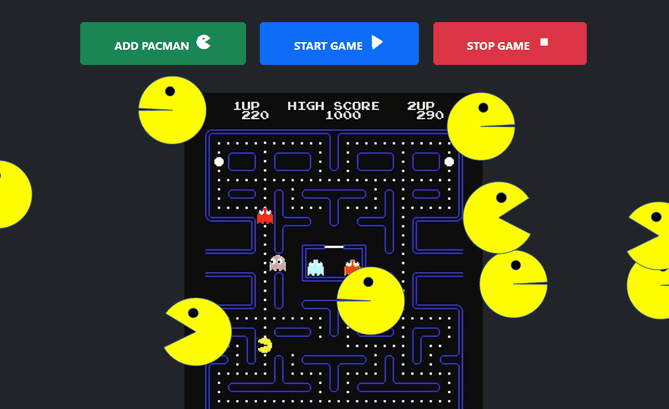

<div align="center" id="top"> 
  

  &#xa0;

  <!-- <a href="https://Pacmen.netlify.app">Demo</a> -->
</div>

<h1 align="center">Pacmen</h1>


<p align="center">
  

  

  

  

  <!--  -->

  <!--  -->

  <!--  -->
</p>

<!-- Status -->

<!-- <h4 align="center"> 
	🚧  Pacmen 🚀 Under construction...  🚧
</h4> 

<hr> -->

<p align="center">
  <a href="#dart-about">About</a> &#xa0; | &#xa0; 
  <a href="#rocket-Roadmap">Roadmap of future improvements</a> &#xa0; | &#xa0;
  <a href="#checkered_flag-starting">How to run</a> &#xa0; | &#xa0;
  <a href="#memo-license">License</a> &#xa0; | &#xa0;
  <a href="https://github.com/GaferCarla" target="_blank">Author</a>
</p>

<br>

## :dart: About ##

Excercise for 7th week from Full Stack Development with MERN´s curse.

This activity contains a button called "ADD Pacmen" that add a div with the Pacmen´s frame inside at a random position. Infinite Pacmens can be added before and after starting the function to starting the game with the button "Star Game".

Upon starting the game, Pacmen will scroll horizontally and vertically across the screen, changing direction and alternating frames for the mouth opening animation.

A button "Stop game" has been included to stop the movement of the Pacmen.


## :rocket: Roadmap of future improvements ##

It is planned to add a button to restart the game because the only way to do it is to restart the browser


## :checkered_flag: How to run ##

Press the "Add PacMan" button to increase the figures of the PacMan.
Press the "Play" button to move the pacman across the screen.
If you want to stop the game, press "Stop"

To view the PacMen factory in action, visit <a href="https://gafercarla.github.io/Pacmen/">here<a>.


To modify the files or add them to your own site, download/clone the repository. All contents within the repository are required for the software to function.


```bash
# Clone this project
$ git clone https://github.com/GaferCarla/Pacmen

# Access
$ cd Pacmen

# Install dependencies
$ yarn

# Run the project
$ yarn start

# The server will initialize in the <http://localhost:3000>
```

## :memo: License ##

This project is under license from MIT. For more details, see the [LICENSE](LICENSE.md) file.


Made with :heart: by <a href="https://github.com/GaferCarla" target="_blank">Gafer</a>

&#xa0;

<a href="#top">Back to top</a>
